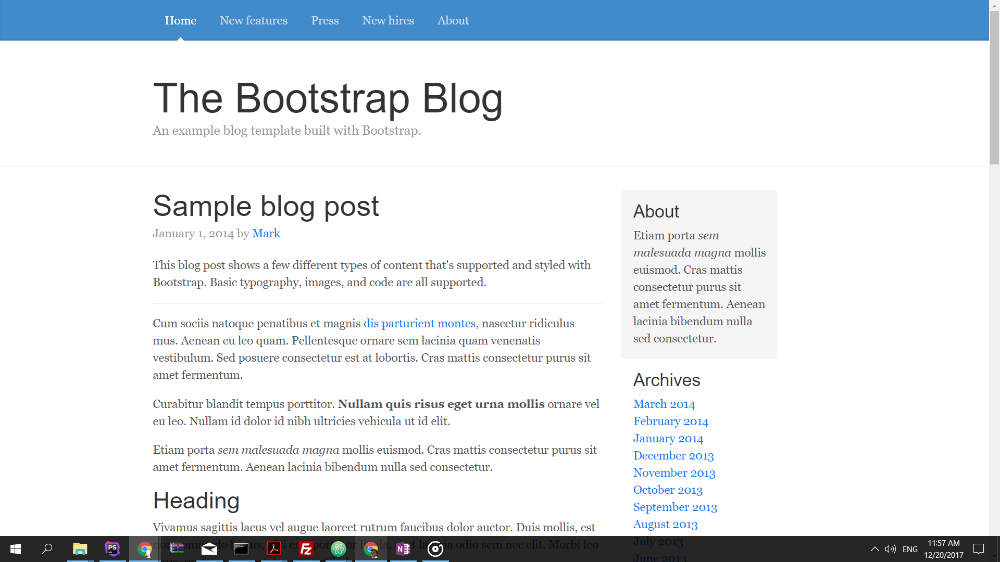

# Wordpress starter theme for bootstrap 4 blog theme example

A starter theme to do a quick wordpress theme development using bootstrap 4 css framework. It is not advisable to directly use this as your theme, although not impossible. This starter theme should be used to quickly develop a blog theme using bootstrap 4 css framework. It is preferable for beginners who actually want to understand how wordpress works.

You can find the html version of this theme at bootstrap 4 examples
[link to bootstrap 4 blog example theme]https://v4-alpha.getbootstrap.com/examples/blog/

The theme includes
* Blog/Listing page template,
* Single Page template
* A page template

To start working on the starter theme, change the following information

* style.css
  * Change The information in the file to reflect your project and your purpose.
* functions.php
  * To add additional functionalities
* footer.php  
  * To change information related to your project
